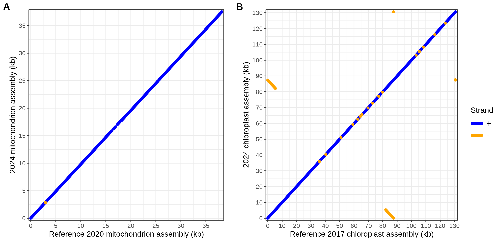

# s-latissima-organelles

# Organelle genome assembly of the brown macroalga *Saccharina latissima* (North American sugar kelp)
Scripts to score and compare the organelle genome assemblies (chloroplast and mitochondrion) of *S. latissima* to previous assemblies.

## 1. Assembly
### Subset reads that BLAST to organelle genomes
### Flye assembler

## 2. MUMmer assembly alignment
### Run MUMmer and generate dotplots to show sequence similarity and inversions
##### Usage
> sbatch mummer_organelles.sbatch \<ref.fasta\> \<query.fasta\>
##### Examples
```
sbatch s-latissima-organelles/mummer_organelles.sbatch s-latissima-organelles/organelles.txt
```


